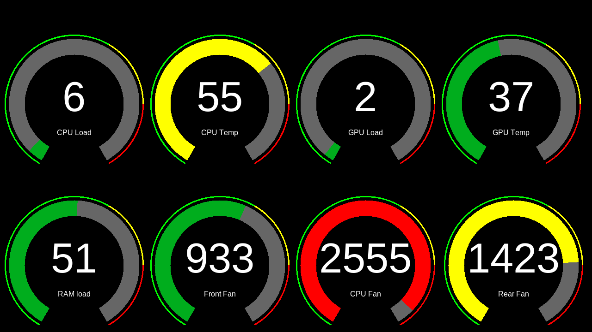

## Hardware Monitor Display - Pi Server

Read CPU and GPU temperature readings from a Windows PC, then display them as a set of gauges on an external display connected to a Raspberry Pi.

This is the set of python scripts that runs on the Pi. For the windows client see this repository: https://github.com/aliktb/Hardware-Monitor-Display-PC-Client

-----

### Requirements

1. Visual Studio 2017 or 2019 with latest update
2. Windows 10 (admin account) with .Net Framework 4.6.2
3. Raspberry Pi (tested with model 3B+ but should work with any variant) with Micro SD card and monitor
4. ethernet cable and optional USB to ethernet dongle if no spare ethernet is available on PC

### Installation

1. Download a fresh copy of Raspbian and install to micro SD (any Pi) or USB (only works on Pi 4). Make sure to include Desktop in install. No lite versions will work as tkinter python module requires X window display server to be running.
2. Configure static IP as `190.160.1.5` (not like the common network prefix of 192.168.xxx.xxx). Static IP can be configured by editing the `/etc/dhcpcd.conf` file. Example configs can be found as comments in the file.
3. Place python files in a new directory in the user's home directory eg. Documents, Downloads etc.
4. Append the following line at the end of the file:
    `@/usr/bin/python3 /home/USER/DIRECTORY_OF_PYTHON_FILES/main.py`
5. Connect Pi to PC via ethernet cable. Can be done with PC motherboard's LAN input or USB to ethernet dongle
6. Connect monitor to Pi vid HDMI. (Currently works with resolution of 1280 x 720)
7. Restart the Pi

### Usage

1. Make sure Pi is connected to PC via ethernet
2. Turn on Pi
3. Use PC client to connect to PC

### Credits

Temperature data obtained from [Open Hardware Monitor](https://github.com/openhardwaremonitor/openhardwaremonitor)'s `OpenHardwareMonitorLib`

Inspiration and original code: https://github.com/logchan/open-hardware-monitor-arduino

Forked from: https://github.com/octal-ip/open-hardware-monitor-arduino
